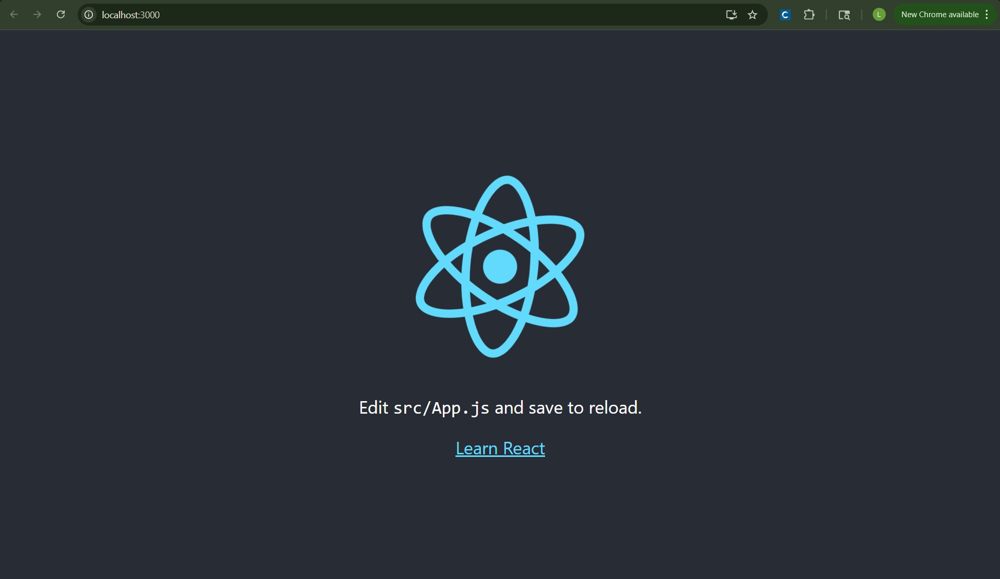
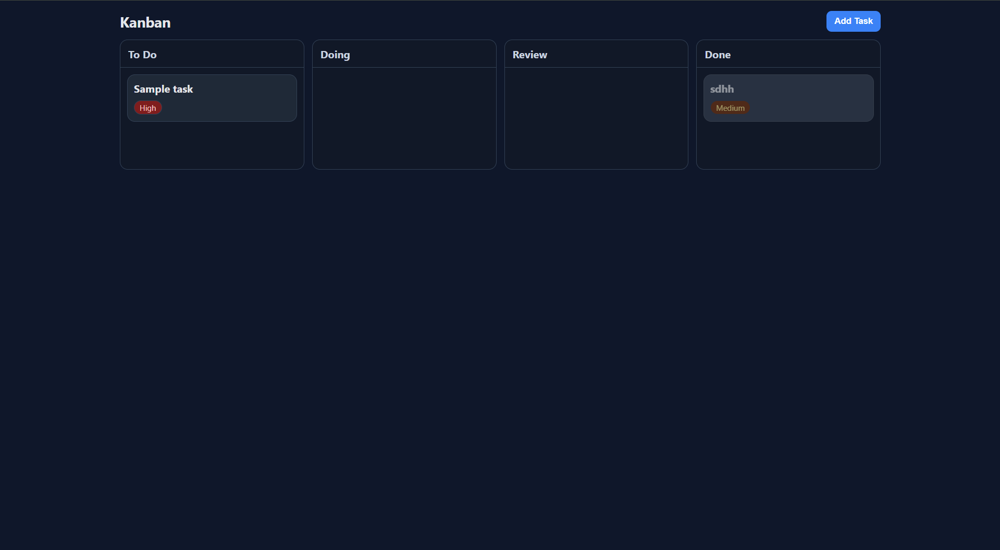
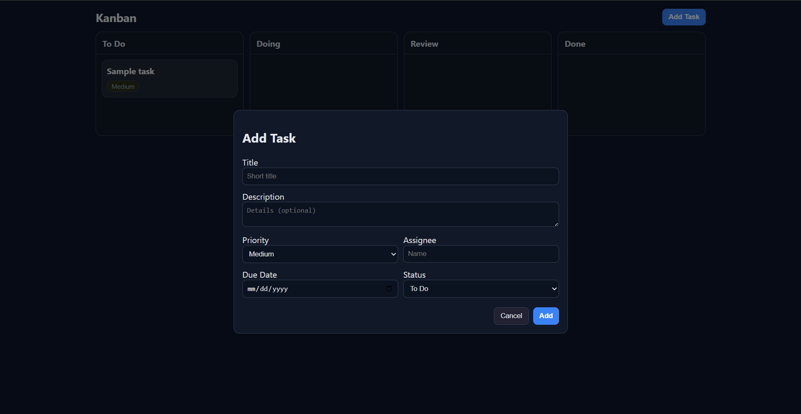
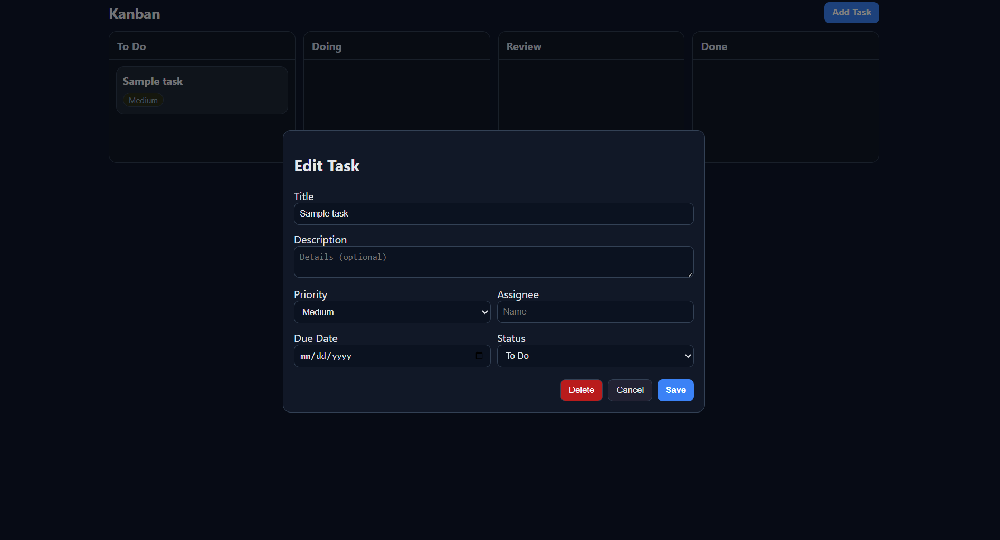
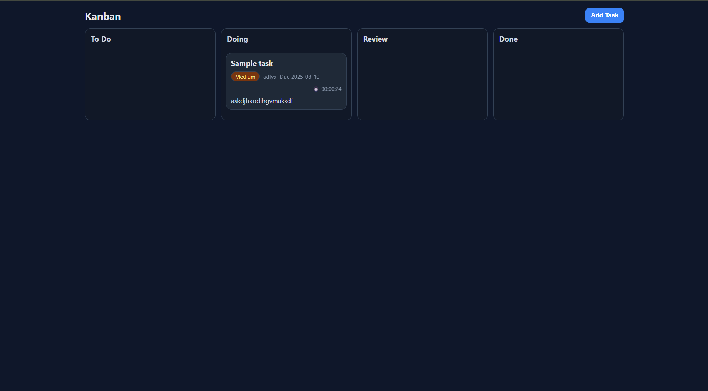
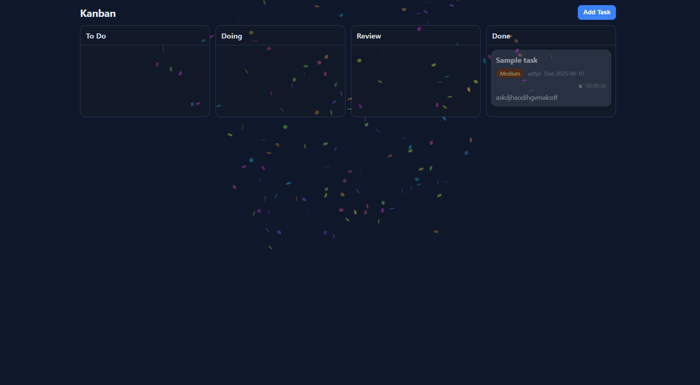

Lijun's Kanban board
====================

## First: setup

I used these commands to create a project.

npm -v

npx -v

npx create-react-app kanban-board

Now http://localhost:3000/ looks like this:

## Step 2: Framework (20 min)

Features
---------

Four Columns in Time Order: To Do → Doing → Review → Done. Done tasks are grey.

Add Task: Click "Add Task" to open a form for entering task details (title, description, priority, assignee, due date, status).

Edit Task: Click on any task card to open a pre-filled edit form where you can modify all details.

Delete Task: While editing, click the Delete button to remove the task from the board.

Priority Levels: Low, Medium, High — shown as color-coded labels on each task.

Responsive Layout: Works on desktop and mobile sizes.

Design Choices
--------------

I love to plan things out in priority order and specify my tasks.
To support this, I implemented a priority level field and encourage users to include detailed descriptions, so they have all the context they need later.

The Kanban board includes four stages — To Do, Doing, Review, and Done — arranged in a logical time order to reflect the natural progression of work.

Now I have:

## Step 3: Draging and Moving (40 min)

Interactive Features
---------------------

Drag & Drop: Reorder within a column and move tasks between To Do / Doing / Review / Done via `@hello-pangea/dnd`. Status updates on drop. I tried to make the dragging process as smooth as possible.

Per-Task Timer: When a card is in Doing, its timer auto-starts; moving it out of Doing auto-pauses. The timer stays visible and accumulates time.

Celebration on Done: Dropping or saving a task into Done triggers fireworks (`canvas-confetti`) and a retro coin chime (Web Audio synth).

Lightweight & Snappy: One global tick drives all timers; confetti bursts are short; drag operations avoid unnecessary re-renders.

Design Choices
--------------

I want users to know exactly how much time they spend on each task and to feel a clear sense of achievement when they finish. The board auto-starts a per-task timer when a card enters **Doing** and pauses it when the card leaves; the timer stays visible everywhere and accumulates total time (HH:MM:SS). This gives immediate feedback for focus, effort tracking, and retrospectives.

To emphasize accomplishment, moving a card into **Done** triggers a brief celebration (confetti + a retro coin chime). It’s lightweight and non-blocking, but creates a positive moment that reinforces progress and motivation.

Notes
-------

Some browsers mute audio until the first user interaction. If you don’t hear the coin, click/drag once and try again.

Dependencies are installed with `npm install` (includes `@hello-pangea/dnd` and `canvas-confetti`).

Now I have:

