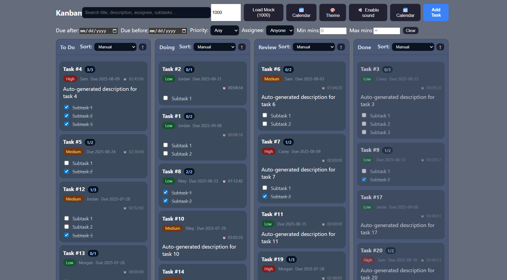

Lijun's Kanban board
====================

## First: setup

I used these commands to create a project.

npm -v

npx -v

npx create-react-app kanban-board

Now http://localhost:3000/ looks like this:

## Step 2: Framework (20 min)

Features
---------

Four Columns in Time Order: To Do → Doing → Review → Done. Done tasks are grey.

Add Task: Click "Add Task" to open a form for entering task details (title, description, priority, assignee, due date, status).

Edit Task: Click on any task card to open a pre-filled edit form where you can modify all details.

Delete Task: While editing, click the Delete button to remove the task from the board.

Priority Levels: Low, Medium, High — shown as color-coded labels on each task.

Responsive Layout: Works on desktop and mobile sizes.

Design Choices
--------------

I love to plan things out in priority order and specify my tasks.
To support this, I implemented a priority level field and encourage users to include detailed descriptions, so they have all the context they need later.

The Kanban board includes four stages — To Do, Doing, Review, and Done — arranged in a logical time order to reflect the natural progression of work.

Now I have:

## Step 3: Draging and Moving (50 min)

Features
---------------------

Drag & Drop: Reorder within a column and move tasks between To Do / Doing / Review / Done via `@hello-pangea/dnd`. Status updates on drop. I tried to make the dragging process as smooth as possible.

Per-Task Timer: When a card is in Doing, its timer auto-starts; moving it out of Doing auto-pauses. The timer stays visible and accumulates time.

Celebration on Done: Dropping or saving a task into Done triggers fireworks (`canvas-confetti`) and a retro coin chime (Web Audio synth).

Lightweight & Snappy: One global tick drives all timers; confetti bursts are short; drag operations avoid unnecessary re-renders.

Design Choices
--------------

I want users to know exactly how much time they spend on each task and to feel a clear sense of achievement when they finish. The board auto-starts a per-task timer when a card enters **Doing** and pauses it when the card leaves; the timer stays visible everywhere and accumulates total time (HH:MM:SS). This gives immediate feedback for focus, effort tracking, and retrospectives.

To emphasize accomplishment, moving a card into **Done** triggers a brief celebration (confetti + a retro coin chime). It’s lightweight and non-blocking, but creates a positive moment that reinforces progress and motivation.

Notes
-------

Dependencies are installed with `npm install` (includes `@hello-pangea/dnd` and `canvas-confetti`).

Now I have:

## Step 4: Sorting Tasks (20 min)

Features
---------

Per-Column Sorting: Each Kanban column (To Do / Doing / Review / Done) can be sorted independently without affecting the others.

Sorting Criteria: Sort tasks within a column by:

Alphabetical — Task title A→Z or Z→A.

Due Date — Soonest or latest first.

Priority — High → Medium → Low, or reverse.

Assignee — Sort by assignee name alphabetically.

Time Spent — Sort by accumulated timer value (longest or shortest).

Always Draggable: Tasks remain draggable even while sorted, so you can reposition any card manually anytime.

Quick Switching: You can sort one column by due date and another by timer at the same time, allowing you to optimize each workflow stage differently.

Design Choices
----------------

I wanted to give users maximum flexibility in organizing tasks, since different workflow stages often require different priorities. For example, Done might be best sorted by due date for reporting, while Review might benefit from sorting by time spent.

By keeping sorting independent per column and allowing drag at all times, the board never locks you into a single rigid view — you can blend structured sorting with freeform reordering for the most efficient task management.

Notes
---------
Sorting controls are built into each column header for quick access. Sorting is instant and lightweight, with no effect on other columns.

Now the kanban board looks like this:

## Step 5: Search & Subtasks (20 min)

Features
----------

Global Search: A search box in the header filters tasks in all columns in real time. Matches are case-insensitive and include task title, description, assignee, and all subtask titles. This makes it easy to instantly find relevant items without scrolling or guessing which column it’s in.

Subtasks (Checklist): Each task can have a checklist of smaller subtasks. Add or edit subtasks in the task modal, reorder them, and toggle completion directly from the card without opening it. Each card shows a progress chip (done/total) so you can track progress at a glance.

Design Choices
---------------

The global search ensures that even large, multi-column boards remain manageable—users can find what they need without losing focus or manually scanning columns. By searching across all major fields (including subtasks), we reduce friction and improve retrieval time.

The subtask checklist supports breaking down large goals into smaller actionable steps. Visible progress chips help sustain motivation, while inline toggles make it quick to update progress. Subtasks do not leave their parent’s card, keeping related work visually grouped.

Now my kanban board become:

## Step 6: Theme & Personalization (Key Feature) (20 min)

Features
-----------

Custom Colors – Users can choose colors for the board background, panels, cards, text, and accent highlights. Each column header can have its own color for easy stage recognition.

Background Image Upload – Users can upload any image (favorite characters, landscapes, etc.) to serve as the Kanban board’s background, with an adjustable opacity slider for perfect blending.

Live Preview & Persistence – All changes are applied instantly and saved to localStorage, so the custom look is restored every time the board is opened.

Per-Column Header Colors – Set individual colors for each column header (To Do, Doing, Review, Done) to improve visual grouping.

Design Choices
---------------

I want my Kanban board to be something I enjoy looking at daily—to feel motivated when managing tasks. Being able to add my favorite anime/game characters or meaningful pictures makes the board personal and uplifting.

People have different tastes, so I gave users complete control over the layout colors and background. This way, the board isn’t just a productivity tool—it’s a space they feel connected to, increasing engagement and encouraging them to come back, organize, and complete tasks.

This is one example:

## Step 7: Metadata Filtering (10 min)

Features
---------------------

Filter Bar – Located above the board, the filter bar allows users to narrow tasks across all columns based on specific metadata:

Due Date – Show only tasks due after (or before) a selected date.

Priority – Filter by Low / Medium / High.

Assignee – Select one or more people from existing task assignees.

Time Spent – Optionally filter by tasks with elapsed time greater or less than a given threshold.

Combined Filters – Multiple filters can be active at the same time (e.g., High priority tasks assigned to Alex that are due after 2025-09-01).

Instant Updates – Filters apply in real time without page reload, and work in combination with the global search feature.

Design Choices
---------------

While the global search feature allows broad keyword matching, metadata filtering provides structured, precise control. This helps users quickly focus on the most relevant tasks when managing large boards, especially in high-volume workflows (1,000+ tasks).

By making filters global (not per-column), users can easily find items regardless of their workflow stage. Filters also combine with search for both broad and targeted querying, giving users flexibility without cluttering the UI.

Now I have:

## Step 8: Calendar View Integration (20 min)

Features
-----------

📅 Calendar View – A dedicated modal view that displays all tasks by their due date on a monthly calendar.

Tasks appear in their assigned date slot, with color-coded priority labels (Low / Medium / High).

Clicking on a task in the calendar opens the edit form, allowing quick updates without leaving the calendar view.

Works with subtasks, timers, and drag-and-drop updates — changes are instantly reflected in both the board and calendar.

Seamless Toggle – The calendar is accessible at any time via the 📅 Calendar button in the top toolbar. The board remains exactly as it was when you return.

Design Choices
----------------
I wanted users to have both a workflow-oriented view (Kanban board) and a time-oriented view (calendar).
The calendar provides an at-a-glance understanding of upcoming work and deadlines, making it easier to plan, avoid bottlenecks, and distribute tasks evenly over time.

By keeping the calendar in a modal, users can quickly reference or adjust deadlines without losing the context of their current board.

This is the calendar page:

## Step 9: Performance & Scalability (40 min)

Features
-----------

Mock Loader (Opt-in): A “Load Mock” button (with a count input) lets you populate N tasks (≥1,000) on demand. No auto-fetch on mount, so normal usage stays snappy until you choose to stress test.

Realistic Mock Backend: The mock API simulates network latency and occasional failures to exercise optimistic UI paths without touching real data.

Per-Card Timer Updates: Removed the global 1-second app tick. Only cards that are actively running re-render once per second, dramatically reducing render pressure with large boards.

Memoized Lists per Column: Filtering + sorting is computed once per column via useMemo, not on every render inside JSX.

Deferred Search: Typing in the global search uses useDeferredValue to avoid re-filtering thousands of tasks on each keystroke.

Drag & Drop Unchanged: All tasks remain draggable even while sorted or filtered.

Quality-of-Life Fixes:

Calendar scroll inside the modal so big months don’t overflow the viewport.

Sound toggle truly enables/disables audio (no sound before enabling, and you can turn it off).

Design Choices
----------------
The main bottlenecks at 1,000+ tasks were:

a global 1s re-render for the entire app (timers), and

per-render filter/sort work done inline during render.

We tackled both by isolating time-based updates to the smallest possible component (only running cards tick) and by memoizing heavy list transforms once per render. The mock loader is opt-in to keep everyday usage light while still making scalability testing trivial.

Notes
------------
Use the header controls to enter a count (e.g., 1500) and click Load Mock to populate tasks.

Sorting and filtering remain independent per column and work with large lists thanks to memoization.

If you still feel strain on very old machines, you can temporarily reduce visual effects while dragging (lighter shadows) or cap visible items per column during testing.

Mock Page:

